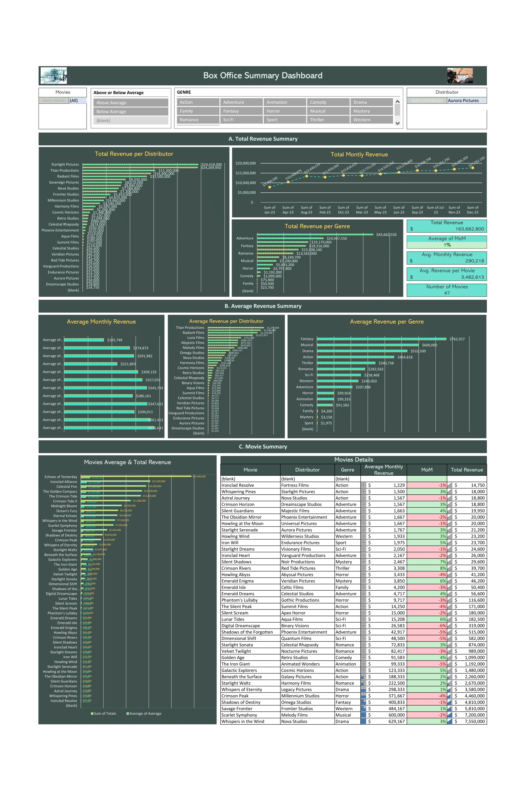

#   Movie Revenue Dashboard

##  Description

This project is an Excel-based dashboard that visualizes movie revenue data for 2023.  It provides insights into film performance, trends, and comparisons across different genres and distributors.

##  Project Goal

The goal of this dashboard is to:

* Track monthly revenue for a set of movies.
* Compare revenue performance across different genres and distributors.
* Identify top-performing and underperforming films.
* Provide a user-friendly tool for exploring the data.

##  Data Source

The data for this project was a provided dataset. I performed data cleaning and transformation in Excel.

##  Tools Used

* Microsoft Excel
* Pivot Tables
* Slicers

##  Visuals

##  Contact

[LinkedIn](https://www.linkedin.com/in/afiq-sigarra/)
